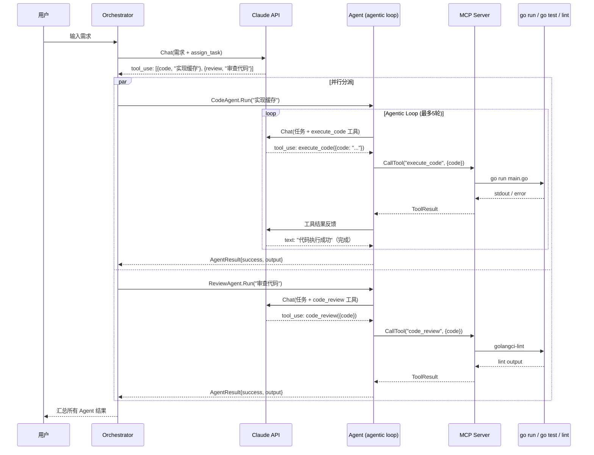

# Multi-Agent：Go + MCP + Claude 多 Agent 协作框架

基于 Go 实现的多 Agent 协作系统，通过 MCP（Model Context Protocol）协议暴露工具，由 Orchestrator 分解任务派发给独立的 Agent，每个 Agent 通过 agentic loop 自主调用 MCP 工具完成任务。

## 项目结构

```
├── main.go                      # Orchestrator 多 Agent 协作调度器
├── cmd/
│   └── server/main.go           # MCP Server 入口（SSE 服务）
├── internal/
│   ├── mcp/
│   │   ├── protocol.go          # MCP 协议数据结构定义
│   │   └── server.go            # SSE Server 实现（含心跳保活）
│   ├── agent/
│   │   ├── runner.go            # Agent 核心实现（agentic loop）
│   │   ├── tools.go             # MCP 工具注册
│   │   └── handlers.go          # 工具处理器（execute_code/run_tests/code_review）
│   └── llm/
│       └── claude.go            # Claude API 客户端
├── go.mod
└── go.sum
```

## 架构设计

```
┌─────────────────────────────────────────────────────────────────┐
│                      Orchestrator (main.go)                      │
│  职责：接收用户需求 → Claude 分解任务 → 分派给 Agent → 汇总结果    │
└──────────┬──────────────────┬──────────────────┬────────────────┘
           │                  │                  │
     ┌─────▼─────┐     ┌─────▼─────┐     ┌─────▼─────┐
     │ CodeAgent  │     │ TestAgent  │     │ReviewAgent│
     │ (agentic   │     │ (agentic   │     │ (agentic  │
     │  loop)     │     │  loop)     │     │  loop)    │
     └─────┬──────┘     └─────┬──────┘     └─────┬─────┘
           │                  │                  │
           └──────────────────┼──────────────────┘
                              │ MCP Protocol (SSE)
                    ┌─────────▼─────────┐
                    │   MCP Server      │
                    │   (:8080)         │
                    ├───────────────────┤
                    │ • execute_code    │
                    │ • run_tests       │
                    │ • code_review     │
                    └─────────┬─────────┘
                              │
                    ┌─────────▼─────────┐
                    │  实际执行环境       │
                    │ • go run          │
                    │ • go test         │
                    │ • golangci-lint   │
                    └───────────────────┘
```

## 调用链路

### 完整调用流程

```
用户输入需求
    │
    ▼
┌─────────────────────────────────────────────────────────────┐
│  Orchestrator                                               │
│                                                             │
│  ProcessRequest()                                           │
│  ├── claude.Chat(需求 + assign_task 工具)                     │
│  │       → Claude 返回 tool_use: [{agent, description}...]  │
│  │                                                          │
│  ├── 解析出 Task 列表                                        │
│  │                                                          │
│  └── 并行 dispatchToAgent()                                  │
│       ├── agents["code"].Run(task)  ──┐                     │
│       ├── agents["test"].Run(task)  ──┤                     │
│       └── agents["review"].Run(task)──┘                     │
└───────────────────────────────────────│─────────────────────┘
                                        │
                                        ▼
┌─────────────────────────────────────────────────────────────┐
│  Agent (agentic loop, 最多 5 轮迭代)                          │
│                                                             │
│  每轮迭代：                                                   │
│  ├── claude.Chat(对话历史 + 工具定义)                          │
│  │       → Claude 决定调用什么工具、传什么参数                  │
│  │                                                          │
│  ├── 如果 Claude 返回 text（无 tool_use）→ 任务完成            │
│  │                                                          │
│  └── 如果 Claude 返回 tool_use：                              │
│       ├── 验证 Agent 是否有权使用该工具                        │
│       ├── callMCPTool(toolName, args) ──► MCP Server        │
│       ├── 将工具结果反馈给 Claude                             │
│       └── 进入下一轮迭代                                     │
└─────────────────────────────────────────────────────────────┘
                        │
                        ▼ (MCP Protocol)
┌─────────────────────────────────────────────────────────────┐
│  MCP Server                                                 │
│                                                             │
│  ├─► execute_code → 安全检查 → go run → stdout              │
│  ├─► run_tests    → 路径验证 → go test → 结果               │
│  └─► code_review  → golangci-lint → lint 报告               │
└─────────────────────────────────────────────────────────────┘
```

### 时序图



### Agent 类型与能力

| Agent | 系统角色 | 可用 MCP 工具 | 能力 |
|-------|----------|---------------|------|
| CodeAgent | Go 代码执行专家 | `execute_code` | 编写代码→执行→分析错误→修复→重试 |
| TestAgent | Go 测试专家 | `run_tests` | 运行测试→分析失败→给修复建议 |
| ReviewAgent | Go 代码审查专家 | `code_review` | lint 检查→质量评估→改进建议 |

### 关键设计：Agentic Loop

每个 Agent 并不是简单的"调一次工具就结束"，而是有自己的**推理-行动循环**：

```
Agent.Run(task)
    │
    ├── 第 1 轮：Claude 分析任务 → 决定写代码 → execute_code
    │       → 执行失败（编译错误）
    │
    ├── 第 2 轮：Claude 看到错误 → 修复代码 → execute_code
    │       → 执行成功
    │
    └── 第 3 轮：Claude 确认结果 → 返回总结（无 tool_use = 完成）
```

这使得 Agent 能够**自我纠错**，而不是遇到错误就直接失败。

## 使用方式

```bash
# 终端 1：启动 MCP Server
go run ./cmd/server

# 终端 2：运行 Orchestrator
export ANTHROPIC_API_KEY="sk-ant-xxx"
go run .
```

## 技术要点

- **三层架构**：Orchestrator（调度）→ Agent（决策）→ MCP Server（执行）
- **Agentic Loop**：Agent 与 LLM 多轮对话，自主决定工具调用时机和参数
- **工具权限隔离**：每个 Agent 只能调用自己被授权的 MCP 工具
- **并发安全**：`sync.WaitGroup` 并行 Agent + `sync.Mutex` 保护共享状态
- **MCP 协议通信**：通过 SSE 连接复用，Agent 共享 MCP Client
- **代码执行沙箱**：独立临时目录 + 独立 GOCACHE + 超时 + 危险代码检测
- **SSE 心跳**：30s 间隔心跳帧防止长连接超时
