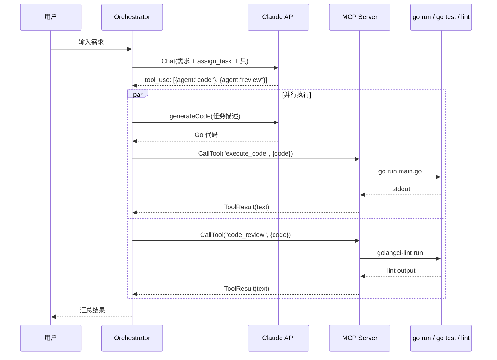

# Multi-Agent：Go + MCP + Claude 多 Agent 协作框架

基于 Go 实现的多 Agent 协作系统，通过 MCP（Model Context Protocol）协议暴露工具，由 Claude 做任务分解，goroutine 并行执行子任务。

## 项目结构

```
├── main.go                      # Orchestrator 多 Agent 协作调度器
├── cmd/
│   └── server/main.go           # MCP Server 入口（SSE 服务）
├── internal/
│   ├── mcp/
│   │   ├── protocol.go          # MCP 协议数据结构定义
│   │   └── server.go            # SSE Server 实现（含心跳保活）
│   ├── agent/
│   │   ├── tools.go             # MCP 工具注册
│   │   └── handlers.go          # 工具处理器（execute_code/run_tests/code_review）
│   └── llm/
│       └── claude.go            # Claude API 客户端
├── go.mod
└── go.sum
```

## 调用链路

项目包含两条独立的调用链路，通过 MCP 协议串联：

### 完整调用流程

```
用户输入需求
    │
    ▼
┌─────────────────────────────────────────────────────────────┐
│  Orchestrator (main.go)                                     │
│                                                             │
│  1. ProcessRequest()                                        │
│     ├── claude.Chat() ──► Anthropic API                     │
│     │       传入 assign_task 工具定义                          │
│     │       ◄── 返回 tool_use: [{agent, description}...]     │
│     │                                                       │
│     ├── 解析 Claude 返回的 tool_use content blocks            │
│     │   生成 Task 列表（code/test/review）                    │
│     │                                                       │
│     └── sync.WaitGroup 并行执行子任务                          │
│         ├── goroutine: executeTask(task1)                    │
│         ├── goroutine: executeTask(task2)                    │
│         └── goroutine: executeTask(task3)                    │
│                                                             │
│  2. executeTask()                                           │
│     ├── buildToolArgs() 构建工具参数                           │
│     │   ├── 如果 Claude 已提供代码 → 直接使用                  │
│     │   └── 否则 → generateCode() → Claude 生成代码           │
│     │                                                       │
│     └── mcpClient.CallTool() ──► MCP Server (:8080)         │
│             通过 SSE 连接调用对应工具                           │
│             ◄── 返回工具执行结果                               │
└─────────────────────────────────────────────────────────────┘
    │
    ▼ (SSE/MCP 协议)
    │
┌─────────────────────────────────────────────────────────────┐
│  MCP Server (cmd/server/main.go)                            │
│                                                             │
│  启动流程:                                                   │
│  NewMCPServer() → RegisterTools() → NewSSEServer() → :8080  │
│                                                             │
│  工具路由:                                                   │
│  CallTool ─┬─► "execute_code" → HandleExecuteCode()         │
│            │     ├── 安全检查（大小 64KB / 危险代码模式）       │
│            │     ├── os.MkdirTemp → 写入 main.go             │
│            │     ├── exec.Command("go", "run") [超时 30s]    │
│            │     └── 返回 stdout                             │
│            │                                                │
│            ├─► "run_tests" → HandleRunTests()               │
│            │     ├── 正则验证包路径                            │
│            │     ├── exec.Command("go", "test") [超时 60s]   │
│            │     └── 返回测试结果                             │
│            │                                                │
│            └─► "code_review" → HandleCodeReview()           │
│                  ├── os.MkdirTemp → 写入代码                  │
│                  ├── exec.Command("golangci-lint")           │
│                  └── 返回 lint 结果                           │
└─────────────────────────────────────────────────────────────┘
```

### 时序图



### Agent 类型与工具映射

| Agent | MCP 工具 | 实际执行 |
|-------|----------|----------|
| code | `execute_code` | `go run` 执行代码 |
| test | `run_tests` | `go test -v` 运行测试 |
| review | `code_review` | `golangci-lint` 静态检查 |

## 使用方式

```bash
# 终端 1：启动 MCP Server
go run ./cmd/server

# 终端 2：运行 Orchestrator
export ANTHROPIC_API_KEY="sk-ant-xxx"
go run .
```

## 技术要点

- **MCP 协议通信**：Orchestrator 通过 SSE 连接 MCP Server，使用 `mcp-go` 库的 Client/Server
- **并发安全**：`sync.WaitGroup` 并行任务 + `sync.Mutex` 保护状态写入
- **代码执行沙箱**：独立临时目录 + 独立 GOCACHE + 超时控制 + 危险代码检测
- **SSE 心跳**：30s 间隔发送心跳帧，防止长连接超时断开
- **输入验证**：包路径正则校验防止命令注入，代码大小限制 64KB
